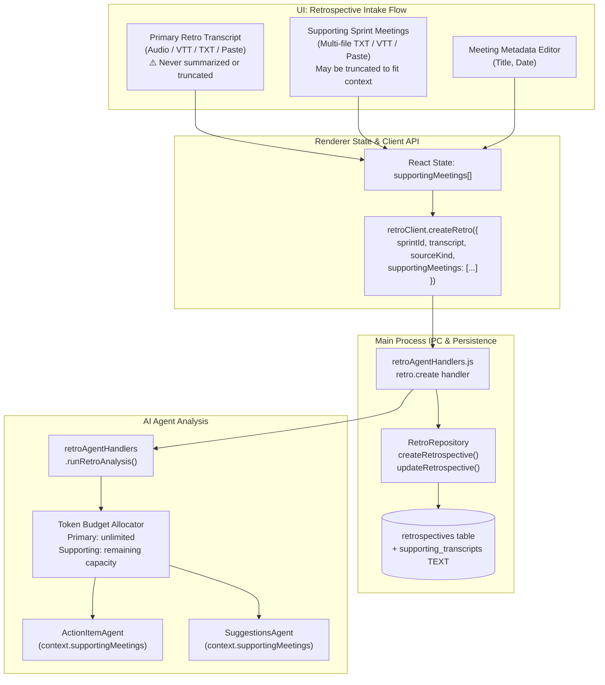

# Implementation Plan: Multi-Meeting Sprint Context in Retro Intake Flow

> **Revision 2** — Addresses all issues from initial plan review. Key changes: versioned DB migration (v6), explicit repository/handler code changes, concrete token budget strategy, audio-only restriction for supporting files scoped out to a future phase, and a hard invariant that the **primary retro transcript is never compacted or summarized**.

---

## Overview

Currently, the **Retro Intake Flow** ([`RetrospectiveIntake.tsx`](file:///Users/mike/WebstormProjects/Flow540/src/components/retrospectives/RetrospectiveIntake.tsx)) allows uploading or pasting only **one** transcript — the main retrospective meeting itself. Sprint metrics (committed vs. completed points, velocity, blockers) provide quantitative context, but qualitative context from other meetings during the sprint (daily standups, mid-sprint check-ins, architecture reviews, bug triages, 1-on-1s) is missing.

This feature extends the Retro Intake Flow to support **uploading and attaching multiple supporting sprint meetings** (text transcripts) alongside the primary retrospective transcript. The AI Agents ([`ActionItemAgent`](file:///Users/mike/WebstormProjects/Flow540/src/helpers/agent/agents/actionItemAgent.ts) and [`SuggestionsAgent`](file:///Users/mike/WebstormProjects/Flow540/src/helpers/agent/agents/suggestionsAgent.ts)) will utilize these supporting meeting logs to connect dots across the entire sprint, uncover root causes of blockers, cross-reference promises made mid-sprint, and generate significantly richer action proposals and coaching insights.

---

## Critical Invariant

> [!CAUTION]
> **The primary retrospective transcript MUST NEVER be compacted, summarized, truncated, or altered in any way before being sent to the AI agents.** It is always passed to the model in full, exactly as the user provided it. Only supporting meeting transcripts may be truncated or summarized to fit within the model's context window.

---

## Architectural Overview & Data Flow



---

## Scope Decisions

### In Scope (This Plan)
- Supporting meeting uploads as **text files** (`.txt`, `.vtt`) and **inline paste**.
- Storage, retrieval, and display of supporting meetings.
- Token-budget-aware injection into agent prompts.
- UI for adding, editing metadata, and removing supporting meetings.

### Out of Scope (Future Phase)
- **Audio file uploads (`.mp3`, `.wav`, `.m4a`) as supporting meetings.** The current single-file audio flow has a dedicated transcription pipeline with progress tracking (`"transcribing"` stage in [`RetroAnalysisProgress`](file:///Users/mike/WebstormProjects/Flow540/src/services/retro/client.ts#L80-L86)). Extending this to handle N parallel audio transcriptions requires significant orchestration work (sequential vs. parallel scheduling, per-file progress UI, per-file error handling) that should be its own plan. Supporting meetings are text-only for now.
- Integration with [`suggestCoachTopics()`](file:///Users/mike/WebstormProjects/Flow540/src/helpers/retroAgentHandlers.js#L429). This runs **before** the retro intake to generate pre-retro agenda topics based on sprint metrics. Supporting transcripts are uploaded during intake and are not available at topic-suggestion time.

---

## Detailed Data Models & API Contracts

### 1. New Type: `SupportingMeeting` — [`src/services/retro/client.ts`](file:///Users/mike/WebstormProjects/Flow540/src/services/retro/client.ts)

```typescript
export interface SupportingMeeting {
  id: string;                          // UUID, generated client-side
  title: string;                       // User-editable, e.g. "Day 4 Standup"
  transcript: string;                  // Full text content
  sourceKind: "text" | "paste";        // Audio not supported for supporting meetings
  meetingDate?: string | null;         // ISO date string
  fileName?: string | null;            // Original file name
  wordCount?: number;                  // Computed client-side for UI display
}
```

### 2. Updated Type: `Retrospective` — [`src/services/retro/client.ts`](file:///Users/mike/WebstormProjects/Flow540/src/services/retro/client.ts)

Add `supporting_transcripts` field to the existing interface:

```diff
 export interface Retrospective {
   id: string;
   title: string;
   sprint_id: string;
   transcript: string;
   source_kind: "audio" | "text" | "paste";
   audio_path: string | null;
   meeting_owner?: string | null;
+  supporting_transcripts?: string | null;  // JSON string of SupportingMeeting[]
   pending_proposals_count?: number;
   processing_state: "idle" | "transcribing" | "analyzing" | "review" | "completed";
   analysis_run_count: number;
   created_at: string;
   updated_at: string;
 }
```

### 3. Updated Client Method: `retroClient.createRetro` — [`src/services/retro/client.ts`](file:///Users/mike/WebstormProjects/Flow540/src/services/retro/client.ts#L187-L194)

```diff
 createRetro: (data: {
   sprintId: string;
   title?: string;
   transcript: string;
   sourceKind: "audio" | "text" | "paste";
   audioPath?: string;
   meetingOwner?: string;
+  supportingMeetings?: SupportingMeeting[];
 }) => invoke<Retrospective>("retro.create", data),
```

---

## Database Migration — [`src/helpers/retroRepository.js`](file:///Users/mike/WebstormProjects/Flow540/src/helpers/retroRepository.js)

Must follow the existing versioned migration pattern. Current schema version is **5** ([line 307](file:///Users/mike/WebstormProjects/Flow540/src/helpers/retroRepository.js#L307)). This adds migration **v6**.

Insert after the `if (currentVersion < 5)` block (after [line 310](file:///Users/mike/WebstormProjects/Flow540/src/helpers/retroRepository.js#L310)):

```javascript
if (currentVersion < 6) {
  const migrateV6 = db.transaction(() => {
    try {
      db.exec(`ALTER TABLE retrospectives ADD COLUMN supporting_transcripts TEXT;`);
    } catch (_) {}
    db.pragma("user_version = 6");
  });
  migrateV6();
}
```

---

## Repository Method Changes — [`src/helpers/retroRepository.js`](file:///Users/mike/WebstormProjects/Flow540/src/helpers/retroRepository.js)

### `createRetrospective()` ([line 414](file:///Users/mike/WebstormProjects/Flow540/src/helpers/retroRepository.js#L414))

Add `supportingMeetings` to the destructured params and include it in the INSERT:

```diff
- async createRetrospective({ sprintId, title, transcript, sourceKind, audioPath, meetingOwner }) {
+ async createRetrospective({ sprintId, title, transcript, sourceKind, audioPath, meetingOwner, supportingMeetings }) {
    const id = randomUUID();
    const retroTitle = title || `Retrospective — ${new Date().toLocaleDateString()}`;
+   const supportingJson = supportingMeetings?.length
+     ? JSON.stringify(supportingMeetings)
+     : null;

    this.db
      .prepare(`
-       INSERT INTO retrospectives (id, title, sprint_id, transcript, source_kind, audio_path, meeting_owner, processing_state)
-       VALUES (?, ?, ?, ?, ?, ?, ?, 'idle')
+       INSERT INTO retrospectives (id, title, sprint_id, transcript, source_kind, audio_path, meeting_owner, supporting_transcripts, processing_state)
+       VALUES (?, ?, ?, ?, ?, ?, ?, ?, 'idle')
      `)
-     .run(id, retroTitle, sprintId, transcript || "", sourceKind || "text", audioPath || null, meetingOwner || null);
+     .run(id, retroTitle, sprintId, transcript || "", sourceKind || "text", audioPath || null, meetingOwner || null, supportingJson);

    return this.getRetrospective(id);
  }
```

### `updateRetrospective()` ([line 445](file:///Users/mike/WebstormProjects/Flow540/src/helpers/retroRepository.js#L445))

Add a field handler for `supporting_transcripts` alongside the existing handlers:

```diff
    if (data.meeting_owner !== undefined) {
      fields.push("meeting_owner = ?");
      values.push(data.meeting_owner);
    }
+   if (data.supporting_transcripts !== undefined) {
+     fields.push("supporting_transcripts = ?");
+     values.push(
+       typeof data.supporting_transcripts === "string"
+         ? data.supporting_transcripts
+         : JSON.stringify(data.supporting_transcripts)
+     );
+   }
```

---

## IPC Handler Changes — [`src/helpers/retroAgentHandlers.js`](file:///Users/mike/WebstormProjects/Flow540/src/helpers/retroAgentHandlers.js)

No new IPC operations are needed. The existing `retro.create` handler at [line 98](file:///Users/mike/WebstormProjects/Flow540/src/helpers/retroAgentHandlers.js#L98) already passes `payload` straight to `repo.createRetrospective(payload)`, so the new `supportingMeetings` field flows through automatically once the repository method is updated.

> [!NOTE]
> The earlier draft proposed a `retro.copySupportingAudio` IPC operation. This is no longer needed since supporting meetings are text-only in this phase. If audio support is added later, a new operation would be added to the [`ALLOWED_OPS` set](file:///Users/mike/WebstormProjects/Flow540/src/helpers/retroAgentHandlers.js#L49-L85) and `switch` block at that time.

---

## Agent Interface Changes

### `ActionItemExtractionOptions.context` — [`src/helpers/agent/agents/actionItemAgent.ts`](file:///Users/mike/WebstormProjects/Flow540/src/helpers/agent/agents/actionItemAgent.ts#L13-L18)

```diff
 context?: {
   meetingTitle?: string;
   teamMembers?: string[];
   projectContext?: string;
   sprintId?: string;
+  supportingMeetings?: { title: string; transcript: string; meetingDate?: string | null }[];
 };
```

### `SuggestionsAgentOptions.context` — [`src/helpers/agent/agents/suggestionsAgent.ts`](file:///Users/mike/WebstormProjects/Flow540/src/helpers/agent/agents/suggestionsAgent.ts#L13-L28)

```diff
 context?: {
   meetingTitle?: string;
   teamMembers?: string[];
   sprintMetrics?: { ... };
   previousActionItems?: string[];
+  supportingMeetings?: { title: string; transcript: string; meetingDate?: string | null }[];
 };
```

---

## Token Budget Strategy

The model's available context window (returned by [`describeModel()`](file:///Users/mike/WebstormProjects/Flow540/src/services/retro/client.ts#L88-L93) as `contextLength`) must be allocated across the primary transcript, supporting context, system prompt, sprint metrics, and output buffer. The existing [`chunkTranscript()`](file:///Users/mike/WebstormProjects/Flow540/src/utils/retroChunking.ts) utility was designed for single transcripts and is **not** used in this allocation — it remains available for chunked analysis if needed elsewhere.

### Allocation Rules

| Segment | Budget | Compressible? |
|---------|--------|---------------|
| System prompt + sprint metrics + output buffer | ~2,500 tokens (fixed) | No |
| **Primary retro transcript** | **Unlimited — uses whatever it needs** | **⛔ Never** |
| Supporting meeting transcripts | Remaining capacity after primary | ✅ Yes — truncated by recency |

### Implementation in `runRetroAnalysis()` ([retroAgentHandlers.js:277](file:///Users/mike/WebstormProjects/Flow540/src/helpers/retroAgentHandlers.js#L277))

```javascript
// 1. Calculate available budget for supporting context
const CHARS_PER_TOKEN = 3.5;
const FIXED_OVERHEAD_TOKENS = 2500; // system prompt + metrics + output buffer
const primaryTokens = Math.ceil((retro.transcript || "").length / CHARS_PER_TOKEN);
const totalBudgetTokens = modelStatus.contextLength || 4096;
const supportingBudgetTokens = Math.max(0, totalBudgetTokens - FIXED_OVERHEAD_TOKENS - primaryTokens);
const supportingBudgetChars = Math.floor(supportingBudgetTokens * CHARS_PER_TOKEN);

// 2. Parse and fit supporting meetings into budget
let supportingMeetings = [];
if (retro.supporting_transcripts) {
  try {
    const parsed = JSON.parse(retro.supporting_transcripts);
    if (Array.isArray(parsed)) {
      // Sort by meeting date descending (most recent first — closest to retro)
      parsed.sort((a, b) => (b.meetingDate || "").localeCompare(a.meetingDate || ""));

      let usedChars = 0;
      for (const m of parsed) {
        const entryChars = (m.transcript || "").length + (m.title || "").length + 50; // overhead
        if (usedChars + entryChars <= supportingBudgetChars) {
          supportingMeetings.push(m);
          usedChars += entryChars;
        } else if (usedChars < supportingBudgetChars) {
          // Partial fit: truncate this transcript to fill remaining space
          const remaining = supportingBudgetChars - usedChars - 80;
          if (remaining > 200) {
            supportingMeetings.push({
              ...m,
              transcript: m.transcript.substring(0, remaining) + "\n[...truncated]",
            });
          }
          break; // No more room
        } else {
          break;
        }
      }
    }
  } catch (e) {
    debugLogger.warn("Failed to parse supporting_transcripts JSON", { error: e.message });
  }
}

// 3. Pass to agents — primary transcript always in full
const context = {
  meetingTitle: retro.title || `Retrospective ${retrospectiveId}`,
  sprintId: retro.sprint_id,
  projectContext: sprint ? `Sprint: ${sprint.name}` : undefined,
  sprintMetrics: sprint ? { /* ... existing ... */ } : undefined,
  supportingMeetings, // May be empty, partially filled, or all meetings
};
```

### Frontend Token Estimation

The UI token counter in the intake form uses the same `3.5 chars/token` estimate and the `contextLength` from `modelStatus` to show the user how much context budget remains. This is **informational only** — it does not prevent submission. The backend allocation above handles the actual fitting.

---

## Agent Prompt Extensions

### `runActionItemAgent` — [`actionItemAgent.ts`](file:///Users/mike/WebstormProjects/Flow540/src/helpers/agent/agents/actionItemAgent.ts#L92-L100)

Insert after the existing context block:

```typescript
if (options.context?.supportingMeetings?.length) {
  prompt += `\n\nSupporting Sprint Meetings (for cross-referencing blockers & commitments made mid-sprint):\n`;
  for (const m of options.context.supportingMeetings) {
    prompt += `\n--- Meeting: ${m.title} (${m.meetingDate || 'During Sprint'}) ---\n${m.transcript}\n`;
  }
  prompt += `\nNote: The PRIMARY retrospective transcript above is the authoritative source. Use these supporting meetings only to corroborate or add context to action items found in the primary transcript.\n`;
}
```

### `runSuggestionsAgent` — [`suggestionsAgent.ts`](file:///Users/mike/WebstormProjects/Flow540/src/helpers/agent/agents/suggestionsAgent.ts#L102-L119)

Insert after the existing context block:

```typescript
if (options.context?.supportingMeetings?.length) {
  prompt += `\n\nSupporting Sprint Meetings & Mid-Sprint Discussions:\n`;
  for (const m of options.context.supportingMeetings) {
    prompt += `\n--- [${m.title}${m.meetingDate ? ` — ${m.meetingDate}` : ''}] ---\n${m.transcript}\n`;
  }
  prompt += `\nInstruction: Synthesize trends between problems raised during mid-sprint meetings and retro discussion points to provide deeper process suggestions. Identify recurring blockers, unaddressed concerns, and patterns that span multiple meetings.\n`;
}
```

---

## Component Specs: `RetrospectiveIntake.tsx`

### New React State

```typescript
const [supportingMeetings, setSupportingMeetings] = useState<SupportingMeeting[]>([]);
```

### UI Layout (Unified Single Dropzone Flow)

1. **Sprint Selection & Metrics** — existing, unchanged
2. **Coach Suggested Agenda** — existing, unchanged
3. **Unified Sprint Transcripts & Meeting Context Container**:
   - Single Multi-file Dropzone accepting audio (`.mp3`, `.wav`, `.m4a`) and transcripts (`.txt`, `.vtt`) at once.
   - Action controls: **Browse files** (multi-file selection) and **Add Notes** (paste modal).
   - Unified Uploaded Sprint Files List:
     - First uploaded file / designated primary file displays `Primary Retro (Never Summarized)` badge.
     - Supporting meeting entries display editable title, source badge (`VTT`, `TXT`, `Pasted`), word count, and a **"Set as Primary Retro"** action button to swap primary retro designation with one click.
     - Individual remove button (`X`) per item.
   - Combined Token Context Budget indicator: *"Total Context: ~X words across Y files • Primary Retro is passed in full · Supporting context scales to model limit"*
4. **Primary Retro Transcript Textarea** — editable view of primary retro text with explicit notice that it is never summarized or truncated.
5. **Model Status / Action Button** — existing, unchanged

### Unified File Handling & Promotion

The unified file batch handler (`handleBatchFileUpload`) accepts multi-file drops and file selections. The first file uploaded becomes the **Primary Retro Transcript**, and subsequent files become **Supporting Meetings**. Clicking **"Set as Primary Retro"** on any supporting meeting promotes it to the primary retro slot and moves the previous primary retro text into the supporting meetings list.

### Wiring to `handleStartAnalysis()`

Update the existing [`handleStartAnalysis()`](file:///Users/mike/WebstormProjects/Flow540/src/components/retrospectives/RetrospectiveIntake.tsx#L289-L326) to pass supporting meetings through to `retroClient.createRetro()`:

```diff
 const retro = await retroClient.createRetro({
   sprintId: selectedSprintId,
   transcript: transcriptText,
   sourceKind: sourceKind,
   audioPath: audioSourcePath || undefined,
   meetingOwner: uploaderIdentity || undefined,
+  supportingMeetings: supportingMeetings.length > 0 ? supportingMeetings : undefined,
 });
```

---

## Phased Implementation Plan

### Phase 1: Database & Backend
1. Add migration v6 to [`retroRepository.js`](file:///Users/mike/WebstormProjects/Flow540/src/helpers/retroRepository.js) — `supporting_transcripts TEXT` column.
2. Update [`createRetrospective()`](file:///Users/mike/WebstormProjects/Flow540/src/helpers/retroRepository.js#L414) — accept and serialize `supportingMeetings`.
3. Update [`updateRetrospective()`](file:///Users/mike/WebstormProjects/Flow540/src/helpers/retroRepository.js#L445) — handle `supporting_transcripts` field.
4. Update TypeScript types and client method in [`client.ts`](file:///Users/mike/WebstormProjects/Flow540/src/services/retro/client.ts).

### Phase 2: Frontend
1. Add `supportingMeetings` state and file handlers to [`RetrospectiveIntake.tsx`](file:///Users/mike/WebstormProjects/Flow540/src/components/retrospectives/RetrospectiveIntake.tsx).
2. Build supporting meetings list UI (title editing, word count, remove).
3. Add context budget indicator using `modelStatus.contextLength`.
4. Wire `supportingMeetings` into `handleStartAnalysis()` → `retroClient.createRetro()`.

### Phase 3: Agent Integration
1. Add `supportingMeetings` to context interfaces in [`actionItemAgent.ts`](file:///Users/mike/WebstormProjects/Flow540/src/helpers/agent/agents/actionItemAgent.ts#L13-L18) and [`suggestionsAgent.ts`](file:///Users/mike/WebstormProjects/Flow540/src/helpers/agent/agents/suggestionsAgent.ts#L13-L28).
2. Implement token budget allocator in [`runRetroAnalysis()`](file:///Users/mike/WebstormProjects/Flow540/src/helpers/retroAgentHandlers.js#L277) — parse `supporting_transcripts`, fit to remaining context budget, pass to agents.
3. Add supporting meeting context blocks to agent prompts with clear instructions distinguishing primary vs. supporting context.

### Phase 4: Verification
1. Test with 0 supporting meetings — behavior identical to current flow.
2. Test with 2–3 small `.txt`/`.vtt` supporting meetings — all included in agent prompts.
3. Test with many/large supporting meetings exceeding context budget — verify oldest are truncated first, primary retro transcript remains unmodified.
4. Verify supporting transcripts persist in SQLite and survive app restart.
5. Verify AI proposals correctly cite or reference observations from supporting meetings.

---

## Key Benefits

- **Deeper Sprint Context**: AI Coach is aware of what happened during the entire 2-week sprint, not just what people remembered to say in the retro meeting.
- **Accurate Blocker Tracing**: Identifies recurring blockers mentioned in daily standups before they resulted in missed sprint commitments.
- **Zero Friction UI**: Multi-file dropzone allows dropping a batch of VTT/text recordings from Zoom/Teams/Slack in one gesture.
- **Safe by Default**: The primary retro transcript is never modified, compressed, or summarized — supporting context is the only content that flexes to fit.
