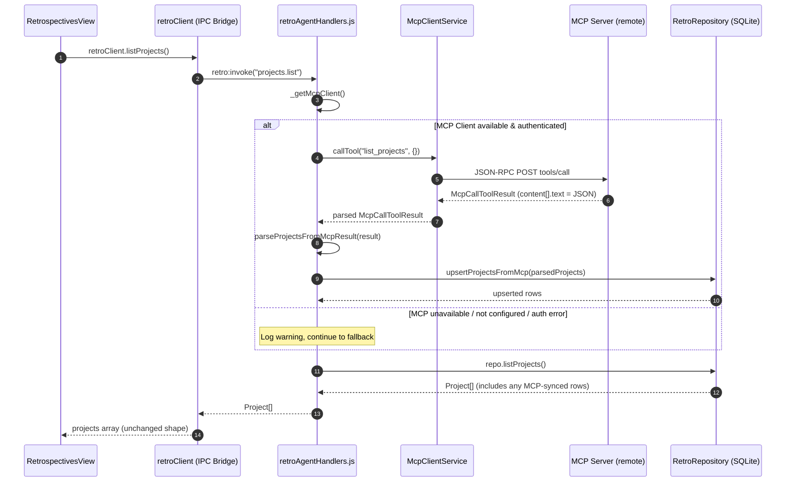

# 🛠️ Implementation Plan: Project Loading via MCP Server

## 1. Overview & Objective

The project dropdown in [`RetrospectivesView.tsx`](file:///Users/mike/WebstormProjects/Flow540/src/components/retrospectives/RetrospectivesView.tsx) currently loads projects by calling `retroClient.listProjects()`, which invokes the `projects.list` IPC operation in [`retroAgentHandlers.js`](file:///Users/mike/WebstormProjects/Flow540/src/helpers/retroAgentHandlers.js#L145-L146), which queries the local SQLite `projects` table via [`retroRepository.js`](file:///Users/mike/WebstormProjects/Flow540/src/helpers/retroRepository.js#L878-L881).

The goal is to **augment** this flow so that when an MCP server is connected and authenticated, `projects.list` first attempts to fetch projects from the remote MCP server via `McpClientService.callTool()`, upserts the results into local SQLite, and returns the merged list. If the MCP server is unavailable, it falls back silently to the existing local query.

> [!IMPORTANT]
> This is **not** an LLM agent task. No system prompt, no `ToolLoopAgent`, no token budget. It is a thin MCP tool call + local DB sync executed inside the existing `retroAgentHandlers.js` handler. The existing agents (`actionItemAgent`, `suggestionsAgent`) use LLM reasoning loops because they need to *interpret* unstructured text — fetching a project list is structured data retrieval.

---

## 2. Architecture & Data Flow



> [!NOTE]
> The final `repo.listProjects()` call always runs regardless of MCP success/failure. This means the UI always gets a complete local snapshot. The MCP call only enriches what's in the local DB before the read happens.

---

## 3. Trigger: When Projects Are Loaded from MCP

### 3.1 Primary Trigger — View Mount (`fetchData`)

The [`RetrospectivesView`](file:///Users/mike/WebstormProjects/Flow540/src/components/retrospectives/RetrospectivesView.tsx#L49-L71) component calls `fetchData()` in a `useEffect` on mount. This calls `retroClient.listProjects()` alongside `listSprints()` and `listRetros()` via `Promise.all`. This is the primary trigger:

```typescript
// RetrospectivesView.tsx — existing code, no changes needed
useEffect(() => {
  fetchData(); // calls retroClient.listProjects() internally
}, []);
```

The MCP fetch happens **transparently inside the handler** — the UI doesn't know or care whether the data came from MCP or local cache.

### 3.2 Secondary Triggers — After Mutations

`fetchData()` is also called after:
- **Creating a new project** (`handleCreateProject` — line 85)
- **Resetting demo data** (`handleResetDemoData` — line 99)
- **Completing a retrospective analysis** (`handleAnalysisSuccess` — line 128)
- **Accepting an action item** (`handleActionAccepted` — line 134)

All of these re-invoke `projects.list`, which will re-sync from MCP if connected.

### 3.3 Manual Refresh Trigger (New)

Add a small refresh button next to the project dropdown so the user can force an MCP re-sync on demand without navigating away:

```
[Folder icon] [Project Dropdown ▼] [🔄]
```

This calls `fetchData()` — same path, just user-initiated. The button should show a brief loading spinner while the fetch is in progress.

### 3.4 What Does NOT Trigger a Load

- Switching tabs (Action Items / Notifications / Insights) — these don't remount the view
- Selecting a different project from the dropdown — this only changes `currentProject` state locally
- Opening the Intake or Review modals — these use already-loaded data

### 3.5 Trigger Summary Table

| Trigger | When | MCP Fetch? |
|---|---|---|
| View mount | User navigates to Retrospectives | ✅ Yes |
| Project created | After "Create Project" modal submit | ✅ Yes |
| Demo data reset | After reset confirmation | ✅ Yes |
| Retro analysis complete | After LLM analysis finishes | ✅ Yes |
| Action accepted | After proposal → tracked action | ✅ Yes |
| Manual refresh button | User clicks 🔄 | ✅ Yes |
| Tab switch | User clicks Action Items / Insights | ❌ No (same component, no remount) |
| Dropdown selection change | User picks different project | ❌ No (local state only) |

---

## 4. Phase 0: Discover MCP Server Tool Inventory

Before writing any code, confirm what the target MCP server actually exposes.

**Action:** With the MCP server running, use the existing "List Available Agent Tools" button in the Notifications tab, or run this from the Electron console / test script:

```typescript
const mcpClient = getAgentSessionManager().getMcpClient();
const tools = await mcpClient.listTools();
console.log(tools.map(t => ({ name: t.name, description: t.description })));
```

**Record:**
- Exact tool name (e.g., `list_projects`, `get_projects`, `projects_list`)
- Input schema (does it accept filters like `{ team_id?: string }`?)
- Output schema (what fields come back per project?)

If no project tool exists, one must be added to the MCP server first — that is out of scope for this plan.

---

## 5. Implementation Steps

### Step 1: MCP Response Parser Utility

Create a small utility to extract typed data from MCP tool results. This is reusable for any future MCP tool call that returns JSON.

**File:** [`src/helpers/agent/mcp/parseMcpResult.ts`](file:///Users/mike/WebstormProjects/Flow540/src/helpers/agent/mcp/parseMcpResult.ts) (new)

```typescript
import type { McpCallToolResult } from './mcp.types.ts';

/**
 * Extracts and JSON-parses the first text content block from an MCP tool result.
 * Returns null if the result is an error, empty, or unparseable.
 */
export function parseMcpJsonResult<T>(result: McpCallToolResult): T | null {
  if (result.isError) return null;

  for (const block of result.content) {
    if (block.type === 'text' && typeof block.text === 'string') {
      const trimmed = block.text.trim();
      if (trimmed.startsWith('{') || trimmed.startsWith('[')) {
        try {
          return JSON.parse(trimmed) as T;
        } catch {
          return null;
        }
      }
    }
  }
  return null;
}
```

### Step 2: Add `upsertProjectsFromMcp` to RetroRepository

**File:** [`src/helpers/retroRepository.js`](file:///Users/mike/WebstormProjects/Flow540/src/helpers/retroRepository.js) — add method to the `RetroRepository` class.

**Sync strategy:**
- **Merge key:** `project_id` (the external identifier, e.g., `"PROJ-GENENG"`)
- **Conflict resolution:** Remote wins for `name`, `description`, `slack_channel_id`. Local `notification_settings` is preserved (never overwritten by MCP).
- **Local-only projects:** Projects that exist locally but not on MCP are **kept** — the user may have created them via the "Create New Project" modal before connecting MCP.
- **MCP-only projects:** Inserted as new rows with a generated UUID `id`.

```javascript
async upsertProjectsFromMcp(mcpProjects) {
  if (!Array.isArray(mcpProjects) || mcpProjects.length === 0) return;

  const upsert = this.db.prepare(`
    INSERT INTO projects (id, name, project_id, slack_channel_id, description, updated_at)
    VALUES (?, ?, ?, ?, ?, datetime('now'))
    ON CONFLICT(project_id) DO UPDATE SET
      name = excluded.name,
      slack_channel_id = CASE
        WHEN excluded.slack_channel_id != '' THEN excluded.slack_channel_id
        ELSE projects.slack_channel_id
      END,
      description = excluded.description,
      updated_at = datetime('now')
  `);

  const transaction = this.db.transaction(() => {
    for (const p of mcpProjects) {
      if (!p.project_id) continue;
      const id = p.id || randomUUID();
      upsert.run(
        id,
        p.name || p.project_id,
        p.project_id,
        p.slack_channel_id || '',
        p.description || ''
      );
    }
  });

  transaction();
}
```

### Step 3: Modify `projects.list` Handler in retroAgentHandlers.js

**File:** [`src/helpers/retroAgentHandlers.js`](file:///Users/mike/WebstormProjects/Flow540/src/helpers/retroAgentHandlers.js#L145-L146)

Replace the existing one-liner with MCP-first logic:

```javascript
case "projects.list": {
  // Attempt MCP sync before reading local DB
  try {
    const mcpClient = this._getMcpClient();
    if (mcpClient) {
      const { parseMcpJsonResult } = require("./agent/mcp/parseMcpResult.ts");
      const result = await mcpClient.callTool("list_projects", {});
      const mcpProjects = parseMcpJsonResult(result);
      if (Array.isArray(mcpProjects) && mcpProjects.length > 0) {
        await repo.upsertProjectsFromMcp(mcpProjects);
        debugLogger.info(`Synced ${mcpProjects.length} projects from MCP server`);
      }
    }
  } catch (err) {
    debugLogger.warn("MCP project sync failed, falling back to local DB", {
      error: err?.message || String(err),
    });
  }
  // Always return from local DB (now enriched with any MCP data)
  return repo.listProjects();
}
```

> [!TIP]
> No changes needed to [`retroClient.listProjects()`](file:///Users/mike/WebstormProjects/Flow540/src/services/retro/client.ts#L253) or the `preload.js` IPC bridge. The return type remains `Project[]`. The MCP sync is invisible to the frontend.

### Step 4: UI — Add Refresh Button & Optional Source Badge

**File:** [`src/components/retrospectives/RetrospectivesView.tsx`](file:///Users/mike/WebstormProjects/Flow540/src/components/retrospectives/RetrospectivesView.tsx#L168-L189)

Minimal change — add a refresh icon button after the project `<select>`:

```diff
 {/* Project Selector */}
 <div className="flex items-center gap-1.5 bg-surface-1 border border-border/60 px-2.5 py-1 rounded-lg text-xs">
   <Folder size={14} className="text-muted-foreground" />
   <select ...>
     {projects.map((p) => (
       <option key={p.id} value={p.id}>
         {p.name} ({p.project_id})
       </option>
     ))}
     <option value="NEW_PROJECT">+ Create New Project...</option>
   </select>
+  <button
+    type="button"
+    onClick={() => fetchData()}
+    disabled={isLoading}
+    className="p-0.5 rounded hover:bg-surface-2 text-muted-foreground hover:text-foreground transition-colors"
+    title="Refresh projects from MCP server"
+  >
+    <RotateCcw size={12} className={isLoading ? "animate-spin" : ""} />
+  </button>
 </div>
```

### Step 5: Tests

**File:** `src/helpers/agent/agents/projectSync.spec.ts` (new)

Test cases:
1. **MCP returns valid projects** → `upsertProjectsFromMcp` is called → `listProjects()` returns merged list
2. **MCP returns empty array** → no upsert → `listProjects()` returns existing local projects
3. **MCP throws error** → warning logged → `listProjects()` returns existing local projects unchanged
4. **MCP returns malformed JSON** → `parseMcpJsonResult` returns null → fallback to local
5. **MCP project with existing `project_id`** → row updated, `notification_settings` preserved
6. **MCP project with new `project_id`** → new row inserted

---

## 6. Files Changed Summary

| File | Change Type | Description |
|---|---|---|
| [`src/helpers/agent/mcp/parseMcpResult.ts`](file:///Users/mike/WebstormProjects/Flow540/src/helpers/agent/mcp/parseMcpResult.ts) | **New** | Generic MCP JSON result parser |
| [`src/helpers/retroRepository.js`](file:///Users/mike/WebstormProjects/Flow540/src/helpers/retroRepository.js) | **Modified** | Add `upsertProjectsFromMcp()` method |
| [`src/helpers/retroAgentHandlers.js`](file:///Users/mike/WebstormProjects/Flow540/src/helpers/retroAgentHandlers.js) | **Modified** | Update `projects.list` case to attempt MCP sync first |
| [`src/components/retrospectives/RetrospectivesView.tsx`](file:///Users/mike/WebstormProjects/Flow540/src/components/retrospectives/RetrospectivesView.tsx) | **Modified** | Add refresh button next to project dropdown |
| `src/helpers/agent/agents/projectSync.spec.ts` | **New** | Unit tests for MCP sync logic |

**Not changed (intentionally):**
- [`src/services/retro/client.ts`](file:///Users/mike/WebstormProjects/Flow540/src/services/retro/client.ts) — `listProjects()` return type stays `Project[]`
- [`preload.js`](file:///Users/mike/WebstormProjects/Flow540/preload.js) — no new IPC channels needed
- [`src/helpers/agent/ipc/agentIpcHandlers.ts`](file:///Users/mike/WebstormProjects/Flow540/src/helpers/agent/ipc/agentIpcHandlers.ts) — no new `agent:fetch-projects` handler

---

## 7. Risk & Open Questions

| Risk | Mitigation |
|---|---|
| MCP tool name unknown | Phase 0 discovery step; fail gracefully if tool doesn't exist |
| MCP call adds latency to every `fetchData()` | The call is `await`ed but fallback is instant; consider adding a timeout (e.g., 5s) to the `callTool` |
| `project_id` UNIQUE constraint may not exist | Verify migration V4 schema has `UNIQUE` on `projects.project_id`; add if missing |
| Upsert overwrites user edits to project name | Acceptable tradeoff — MCP is the source of truth for name/description; `notification_settings` is protected |

> [!WARNING]
> **Open question:** Should the MCP sync run on *every* `projects.list` call, or should it be throttled (e.g., at most once per 60 seconds)? Frequent calls during `fetchData` cascades (create project → fetchData, accept action → fetchData) could be chatty. A simple timestamp-based debounce in the handler would address this.
