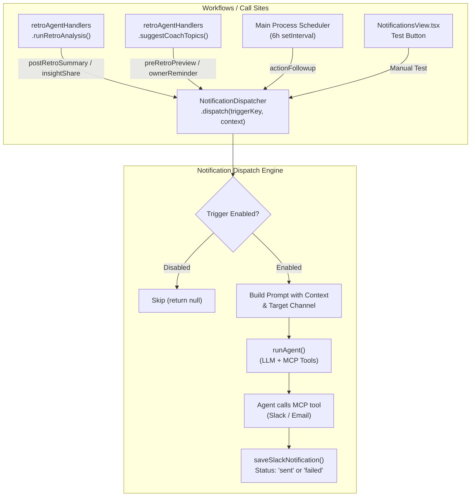

# Plan: Extend Suggestions Agent to Dispatch Agile Coach Notification Triggers

## Overview

Modify the **Suggestions Agent** and retro backend infrastructure so that after analysis, topic generation, or scheduled sprint boundaries, the agent **autonomously composes and dispatches the 5 notification triggers** configured on the Agile Coach Notification Triggers tab ([`NotificationsView.tsx`](file:///Users/mike/WebstormProjects/Flow540/src/components/retrospectives/NotificationsView.tsx)).

Each trigger invocation uses **AI-generated personalized messaging** (via `runAgent()`) and **direct MCP tool dispatch** (Slack/Email), respecting project-level `enabled`/`disabled` toggles and channel preferences.

---

## Final Agreed Architecture & Key Decisions

1. **One Trigger Per Call**: Each workflow call site passes exactly one trigger key to the dispatcher.
2. **Early Enable Gate**: Checked BEFORE calling the LLM to prevent unnecessary API costs and latency if a trigger is disabled.
3. **AI-Generated Compose & Send**: Uses `runAgent()` with a notification-specific system prompt and MCP tools, allowing the model to compose a tailored message and invoke the appropriate Slack/Email tool in a single agentic loop.
4. **Audit Logging**: Every dispatch attempt is recorded in SQLite (`coach_slack_notifications`) with `status = 'sent'` or `'failed'`.
5. **Non-Fatal Automation Error Handling**: Automated background dispatches fail non-fatally (logged & recorded as `'failed'`), while manual UI Test button dispatches report errors directly to the user.
6. **Scheduled Mid-Sprint Followup**: `actionFollowup` runs via a 6-hour `setInterval` background check in the main process, using a configurable `actionFollowupDaysAfterSprintStart` offset (defaults to sprint midpoint) and deduping against existing `coach_slack_notifications` records for the sprint.
7. **Test Button Alignment**: The UI **Test** button is refactored to execute the same end-to-end `dispatch()` pipeline, respecting enabled toggles.

---

## Architecture Diagram

---

## Notification Trigger Mapping & Call Sites

| Trigger Key | Title | Workflow Call Site | Data Context |
|-------------|-------|--------------------|--------------|
| `preRetroPreview` | Pre-Retro Topic Preview | `suggestCoachTopics()` | Suggested agenda topic titles & rationales |
| `ownerReminder` | Action Item Owner Reminders | `suggestCoachTopics()` | Open carried-over action items + assigned owners |
| `postRetroSummary` | Post-Retro Personal Summaries | `runRetroAnalysis()` | Newly created action proposals + owners |
| `insightShare` | Coach Insight Share | `runRetroAnalysis()` | Detected team insights & recurring patterns |
| `actionFollowup` | Mid-Sprint Action Follow-Up | Main Process Scheduler | In-progress action items + completion status |

---

## Detailed Implementation Steps

### Phase 1: Core Notification Engine & Types

Create three new files in `src/helpers/agent/notifications/`:

1. `notificationTypes.ts`:
   - Extend `NotificationConfig` with `actionFollowupDaysAfterSprintStart?: number`.
   - Define `NotificationDispatchContext` and `DispatchResult`.

2. `notificationPrompts.ts`:
   - Parameterized system prompt instructing the model to generate concise, professional Slack/Email messages tailored to the `triggerKey` and context data, and execute the available Slack or Email MCP tool to send it.

3. `notificationDispatcher.ts`:
   - Implements `NotificationDispatcher.dispatch(triggerKey, context, options)`.
   - Loads project settings, checks `config[triggerKey].enabled`, constructs prompt, calls `runAgent()`, and writes audit log to `coach_slack_notifications`.

---

### Phase 2: Retro Agent Handlers & IPC Integration

1. **Inject MCP Client**: Update `RetroAgentHandlers` constructor to receive `mcpClient`.
2. **Wire Call Sites**:
   - In `runRetroAnalysis()`: Call `dispatcher.dispatch('postRetroSummary', ...)` and `dispatcher.dispatch('insightShare', ...)`.
   - In `suggestCoachTopics()`: Call `dispatcher.dispatch('preRetroPreview', ...)` and `dispatcher.dispatch('ownerReminder', ...)`.
3. **Refactor `sendSlackNotification()`**: Re-route through `dispatcher.dispatch()` so test and manual calls share identical logic.

---

### Phase 3: Main Process Scheduler for `actionFollowup`

1. Add `sprintFollowupScheduler.js` in `src/helpers/`:
   - Runs on a 6-hour `setInterval`.
   - Queries active sprints and associated projects.
   - Calculates target followup date (`sprint.created_at` + `actionFollowupDaysAfterSprintStart` days).
   - Checks `coach_slack_notifications` to ensure no `actionFollowup` notification was sent for this project/sprint yet.
   - Invokes `dispatcher.dispatch('actionFollowup', ...)`.

---

### Phase 4: UI Updates & Test Button Refactor

1. **`NotificationsView.tsx`**:
   - Add input field for `actionFollowupDaysAfterSprintStart` (defaulting to 7 days).
   - Refactor `handleTestTrigger` to call `retroClient.sendSlack()` which now routes through the AI agent `dispatch()` flow.
   - Show success/error toasts based on dispatch result.

---

### Phase 5: Verification & Tests

1. Unit tests for `notificationDispatcher.ts`:
   - Verifies enabled/disabled gate skips LLM call when disabled.
   - Verifies non-fatal error handling for automated calls.
   - Verifies audit log rows written with correct status.
2. Integration tests for IPC operations and scheduler logic.
